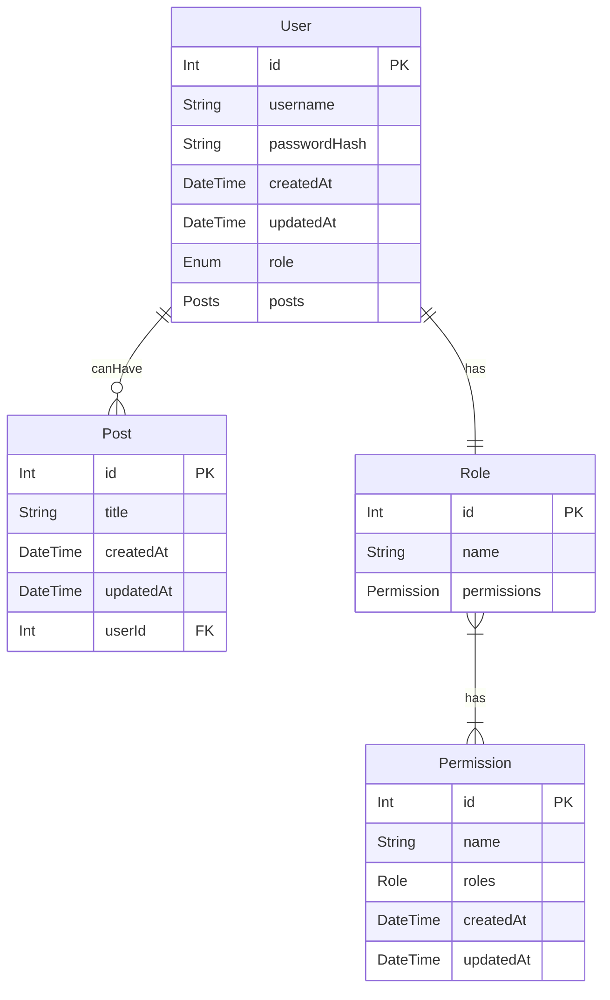

# ERD - meeting extension 1 requirements

## requirements

- Implement a new model named `Permission` which connects roles to specific permissions.

- check that the user performing an action has access to the relevant permission instead of just checking their role.

- replace the role enum with a model and adding a join table to remove the possibility of adding duplicate permission names.

## notes

- since permissions are always connected to user through roles, if a user has a certain role, then we know which permissions they have
- ergo, it does not seem to make much sense to bother checking what permission that role includes, seeing as checking the role would do the same
- unless it is a maintenance issue: if the permissions for a specific role are changed, in the current state of affairs, we'll need to change which middlewares apply to which routes. Which the added permission table, this becomes unecessary
- meaning that a request sent from the front end (if we had one) would be enough to modify what certain users can access
- as opposed to the current state of affaires where changes would need to be made to the api.
- so we'll have a verifyPermission function that accesses the db and checks what permissions a role has

